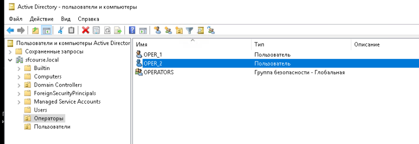
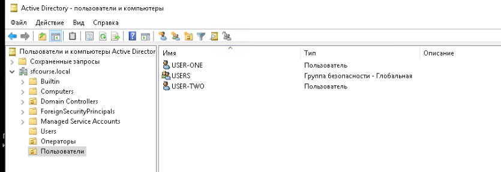
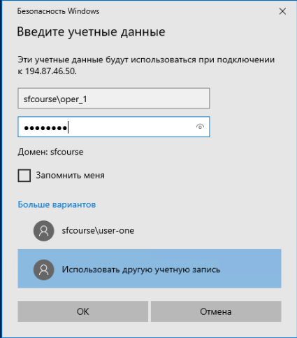
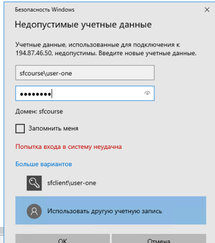
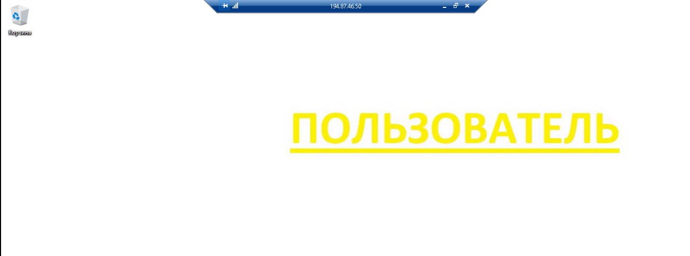
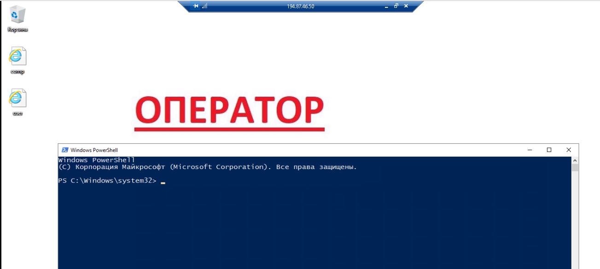
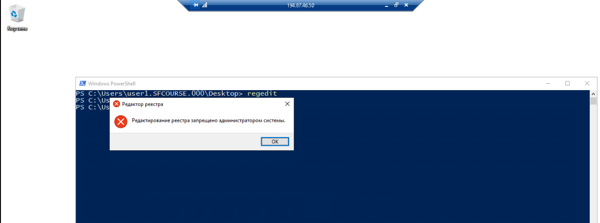

# Вам необходимо произвести настройку Active Directory по следующему ТЗ:

1. Создайте 4 пользователя с двумя функциональными ролями: «пользователь» и «оператор». Функциональные роли выражены в групповых объектах Active Directory (итого — 4 пользователя, по 2 в каждой группе).
2. Для каждой группы создайте групповую политику.
3. Для всех ролей в групповую политику включите следующие правила:

- Минимальное количество символов в пароле — 8;
- Необходимость спецсимволов в пароле — да;
- Максимальное время жизни пароля — 45 дней.

4. Для роли «пользователь»:

- Через групповую политику поставьте задний фон рабочего стола на ваш выбор.
- Отключите возможность смены пароля.
- Запретите редактирование реестра Windows.

5. Для роли «оператор»:

- Через групповую политику поставьте задний фон рабочего стола на ваш выбор. Фон должен отличаться от изображения на рабочем столе «пользователя».
- При входе «оператора» должен открываться PowerShell.

6. Включите KDC Armoring и поставьте значение TheMachineAccountQuota на «5».

## УСЛОВИЯ РЕАЛИЗАЦИИ

В качестве результата предоставьте (загрузите на GitHub и пришлите ссылку на репозиторий):

- скриншоты наличия объектов в Active Directory;

 
 

скриншоты входа на SF_CLIENT под доменными пользователями с разными ролями;

- созданные политики в текстовом виде (как вариант: вывод команд gpresult /scope computer и gpresult /scope user для каждой роли);

  - [computer](./computer.html)
  - [user-one](user-one.html)
  - [operator](./oper_1.html)

- скриншот пользователя с SF_CLIENT (скрин рабочего стола);

- скриншот оператора с SF_CLIENT (скрин рабочего стола);

- скриншот предупреждения после попытки «пользователя» запустить regedit.

Важно! После выполнения задания удалите созданные политики и объекты AD, а также верните атрибуты в исходное состояние.

- [X] DONE